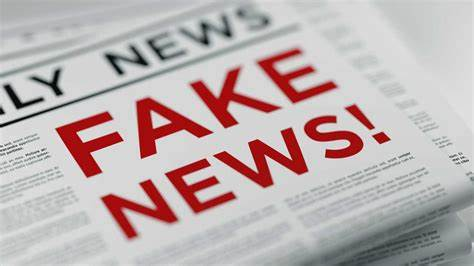

# ML_Fake_News_Detection
Unmasking the Truth: Harnessing Machine Learning to Detect Fake News
Made this project with Python and its libraries: pandas and scikit-learn.

  

Dataset: https://www.kaggle.com/datasets/nopdev/real-and-fake-news-dataset
